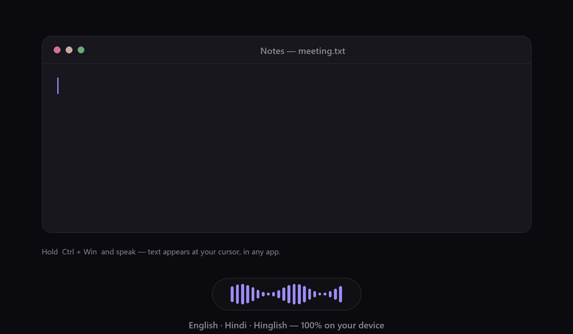

<div align="center">


# Sotto

### Free, private, local dictation for Windows & Linux — hold a hotkey, speak, and accurate text is typed wherever your cursor is.

A fully offline, open-source alternative to cloud dictation tools like Wispr Flow.
**No cloud. No account. No subscription. No telemetry.** Your voice never leaves your PC.

[](https://github.com/smirk-dev/sotto/releases/latest)
&nbsp;
[](LICENSE)
[](#install-in-2-minutes)
&nbsp;
[](#linux-arch)

 &nbsp;
 &nbsp;


<br>



<em>Live dictation in English and Hindi — text appears at your cursor as you speak.</em>

</div>

---

## Why Sotto?

Paid dictation apps are fast and accurate, but they send your microphone to the cloud, cost a
monthly fee, and stop working offline. Sotto gives you the same **press-to-talk, type-anywhere**
workflow while keeping **100% of the audio on your own machine** — for free, forever.

- 🎙️ **Types into any app** — terminals, Word, Excel, browsers, chat, IDEs, even elevated
  windows. Uses simulated keystrokes (works where paste is blocked) with a clipboard-paste
  fallback that saves and restores your clipboard.
- 🌍 **English + Hindi + Hinglish** — auto-detected per phrase, so you can dictate a
  mixed-language meeting. Hindi that Whisper mistakes for Urdu is auto-corrected back to proper
  left-to-right Devanagari. One-click language switch from the tray.
- ⚡ **Live typing** — in toggle mode, text streams onto the page as you speak — great for
  hands-free meeting notes.
- 🧠 **Robust in the real world** — a voice-activity gate ignores static/background noise so it
  never invents phantom text when you're not speaking.
- 🔒 **Private & free** — OpenAI Whisper running locally on Intel **OpenVINO** (int8, CPU). The
  only time it touches the network is a one-time model download you trigger yourself.
- 🪶 **Runs on a normal laptop** — no GPU required.

## Install in 2 minutes

1. **[⬇️ Download the latest release](https://github.com/smirk-dev/sotto/releases/latest)**
   (`Sotto-windows-x64.zip`) and unzip it.
2. Run **`Sotto\Sotto.exe`**. Windows SmartScreen may warn about an unsigned app — click
   *More info → Run anyway*. (Optional: run `install.ps1` for Start-menu shortcuts.)
3. On first launch, open **Settings → Model & language → Download** (one-time, ~300 MB, from the
   official OpenVINO mirror).
4. **Hold `Ctrl + Win`, speak, release.** Your words appear at the cursor. 🎉

> Prefer to build it yourself? See [Build from source](#build-from-source). It's ~400 lines of
> readable Python.

## Linux (Arch)

Sotto runs natively on Linux (X11 **and** Wayland) with the same press-to-talk workflow.

```bash
git clone https://github.com/smirk-dev/sotto && cd sotto/packaging/arch
makepkg -si                       # or: publish to the AUR and `yay -S sotto`
sudo usermod -aG input "$USER"    # one-time: lets the hotkey read the keyboard
# log out / back in, then launch "Sotto" from your app menu
```

The global hotkey is read from `/dev/input` via **evdev** (hence the `input` group),
and typing is delegated to **`xdotool`** (X11) or **`wtype`** (Wayland) so Unicode —
including **Hindi/Devanagari** — is emitted correctly. All dependencies are pulled in
by the package. See [`packaging/arch/`](packaging/arch/) for details.

**Good to know on Linux:**
- Prefer the **hold chord** (default `Ctrl+Super`) or a function-key toggle (`F10`) —
  the toggle combo's trigger key isn't suppressed from the focused app.
- **GNOME-Wayland** lacks the virtual-keyboard protocol `wtype` needs: use an **X11
  session** or install **`ydotool`** as a fallback.

## How it compares

| | **Sotto** | Wispr Flow | Windows Voice Access | Talon |
|---|:---:|:---:|:---:|:---:|
| Runs 100% offline | ✅ | ❌ | ✅ | ✅ |
| Free | ✅ | 💲 subscription | ✅ | ✅ (paid models) |
| Open source | ✅ | ❌ | ❌ | ❌ |
| Types into any app | ✅ | ✅ | ✅ | ✅ |
| Hindi / Hinglish | ✅ | ✅ | limited | ❌ |
| Live "type as you speak" | ✅ | ✅ | ⚠️ | ⚠️ |
| No account required | ✅ | ❌ | ✅ | ✅ |
| Whisper-grade accuracy | ✅ | ✅ | ⚠️ | ⚠️ |

## Using it

**Hold-to-talk** — hold `Ctrl + Win` (either side), speak, release. A pill with a live waveform
shows at the bottom of the screen and never steals focus. Text lands at your cursor, usually in
**under a second**.

**Toggle / live mode** — press `Ctrl + Alt + D` to start, again to stop. Text is typed **as you
speak**, so you can dictate for minutes or take meeting notes hands-free.

**Spoken commands:** “new line”, “new paragraph”, “comma”, “period”/“full stop”, “question mark”,
“exclamation mark”, “colon”, “semicolon”, “open/close quote”. Emails and URLs are formatted
automatically (“name at gmail dot com” → `name@gmail.com`), and filler words (um, uh) are removed.

### Languages (Hindi / Hinglish)

The default is a multilingual model set to **“Auto — English + Hindi.”** Switch any time from the
**tray → Language** menu:

- **Auto — English + Hindi** (default) — detects each phrase; best for mixed/Hinglish sessions.
- **English only** / **Hindi only** — force one language for the most reliable single-language
  results.
- **Auto — all languages** — unconstrained 99-language detection.
- For the fastest *pure-English* dictation, switch **Model** to `base.en` (sub-second).

> **Tip:** if accuracy disappoints, pick a single language instead of Auto, keep the mic close,
> and reduce background noise. Sotto runs a compact model on your CPU, so it trades a little
> accuracy for being fully private and free.

## Features

- **Hotkeys** — configurable hold chord (`Ctrl+Win`, `Alt+Win`, `Ctrl+Alt`, `F9`) and toggle
  combo (`Ctrl+Alt+D`, `Ctrl+Shift+Space`, …).
- **Microphone picker** with a live level meter.
- **Custom dictionary** — teach it names and jargon; they're fuzzy-corrected in the output.
- **Dictation history** — searchable local log, one-click re-copy; disable or clear anytime.
- **Session stats** — words dictated and estimated time saved vs. typing.
- **Start with Windows**, single-instance, subtle start/stop sounds, dark minimal UI.

## Models

Settings → *Model & language*. Downloaded models show a ✓; others show a **Download** button
(one-time, from the official OpenVINO mirrors on Hugging Face).

| Model | Size | Best for |
|---|---|---|
| `tiny.en` | ~60 MB | fastest, English only, lower accuracy |
| `base.en` | ~95 MB | fast, accurate English only — sub-second |
| `small.en` | ~300 MB | most accurate English only |
| `base (multilingual)` | ~95 MB | fast, any language, lower accuracy |
| **`small (multilingual)`** *(default)* | ~300 MB | English + Hindi + Hinglish |
| `large-v3-turbo` | ~830 MB | best accuracy, esp. Hindi/Hinglish — needs an Intel iGPU to be quick |

Data lives in `%LOCALAPPDATA%\Sotto` (models, config, history, log).

**Run on** defaults to *Auto*, which picks the device that is actually faster for the model you
chose. That is the CPU for everything except `large-v3-turbo`, where an Intel iGPU takes it from
**~4.6 s to ~1.8 s** from hotkey release to text (i7-1360P + Iris Xe, measured through the app),
with identical output. The reason is architectural: turbo is ~79% encoder, and Whisper's encoder
is one big parallel pass over a fixed 30 s window — dense, parallel work an iGPU eats. Smaller
models spend their time in the memory-bound decoder instead, where the iGPU is a slight *loss*,
so Auto leaves them on the CPU. Pick CPU or GPU explicitly if you would rather not have it decide;
if the GPU can't run the model, Sotto falls back to the CPU by itself. The first GPU run compiles
the model (~15 s, one time) and caches ~900 MB under `%LOCALAPPDATA%\Sotto\models\ov-cache`.

## FAQ

**Is my audio uploaded anywhere?** No. Transcription runs entirely on your CPU. The only network
request is the one-time model download you start yourself.

**Does it need a GPU?** No — every model runs on the CPU, and the default one is tuned for it. An
Intel iGPU is only worth it for `large-v3-turbo`, where it cuts ~4.6 s per utterance to ~1.8 s;
*Auto* uses it for that model if you have one, and nothing changes for anyone who doesn't.

**The hotkey does nothing — or text isn't typed — in one specific app (often a terminal).** That
app is running **as Administrator** while Sotto isn't. Windows UIPI blocks a normal-privilege app
from *both* typing into *and* seeing hotkeys destined for a higher-privilege window, so the overlay
won't appear while it's focused and dictation lands nowhere (Sotto falls back to copying the text to
your clipboard and shows *"run Sotto as admin"*). Everything at your normal level — Word, browsers,
chat, Obsidian — keeps working. Fix: run Sotto elevated — see
[Dictating into apps that run as Administrator](#dictating-into-apps-that-run-as-administrator).

**Windows says "unknown publisher."** The app is unsigned (code-signing certificates cost money;
Sotto is free). Click *More info → Run anyway*, or build it yourself.

**Can it do languages other than English/Hindi?** Yes — set Language to *Auto — all languages* or
pick a specific one; Whisper supports ~99 languages.

## Dictating into apps that run as Administrator

If an app runs **elevated** (as Administrator) and Sotto doesn't, Windows **UIPI** stops Sotto from
interacting with it: injected keystrokes are silently dropped *and* the global hotkey isn't seen
while that window is focused (the overlay only reappears once you click a normal-privilege window).
The most common case is an **elevated terminal** — e.g. Windows Terminal, or a VS Code integrated
terminal when VS Code itself was started as Administrator. When it happens, Sotto shows *"run Sotto
as admin — text copied"* and puts the transcript on your clipboard so nothing is lost.

Two fixes:

- **Run Sotto elevated.** Launch the **"Sotto (administrator)"** Start-menu shortcut (one UAC prompt
  per launch) so Sotto sits at the same integrity level and can type everywhere. To start it
  elevated automatically at logon **without** a UAC prompt, register a Task Scheduler task that runs
  it with highest privileges:

  ```powershell
  $exe  = "$env:LOCALAPPDATA\Programs\Sotto\Sotto.exe"
  $user = "$env:USERDOMAIN\$env:USERNAME"
  Register-ScheduledTask -TaskName "Sotto (admin autostart)" -Force `
    -Action    (New-ScheduledTaskAction -Execute $exe) `
    -Trigger   (New-ScheduledTaskTrigger -AtLogOn -User $user) `
    -Principal (New-ScheduledTaskPrincipal -UserId $user -LogonType Interactive -RunLevel Highest) `
    -Settings  (New-ScheduledTaskSettingsSet -StartWhenAvailable -ExecutionTimeLimit ([TimeSpan]::Zero))
  ```

  If you do this, turn **off** "Start Sotto when Windows starts" in Settings (or delete
  `…\Startup\Sotto.lnk`) so the non-elevated copy doesn't race the task at logon.

- **Or just don't run the other app as Administrator.** If you don't specifically need it elevated,
  launch it normally and Sotto dictates into it like anywhere else — no elevated Sotto required.

## Build from source

```powershell
git clone https://github.com/smirk-dev/sotto
cd sotto
py -3.13 -m venv .venv
.\.venv\Scripts\python -m pip install faster-whisper sounddevice PySide6-Essentials numpy pyinstaller pillow openvino-genai huggingface_hub
.\.venv\Scripts\python -m PyInstaller sotto.spec --noconfirm   # -> dist\Sotto\Sotto.exe
```

Run the app in dev with `.\.venv\Scripts\python -m sotto`. Tests are in `tests/`;
`PROGRESS.md` documents the engineering decisions and on-machine benchmarks.

## Contributing

Issues, ideas, and PRs are very welcome — see [CONTRIBUTING.md](CONTRIBUTING.md). If Sotto is
useful to you, a ⭐ **star** helps others find it.

## License

[MIT](LICENSE) for Sotto's own code. Bundled components keep their own licenses — see
[THIRD-PARTY-NOTICES.md](THIRD-PARTY-NOTICES.md).

<div align="center"><sub>

Built for people who write by voice. Free and open-source forever.
<br>
<code>dictation · speech-to-text · voice typing · Whisper · offline · Windows · Wispr Flow alternative · Hindi</code>

</sub></div>
