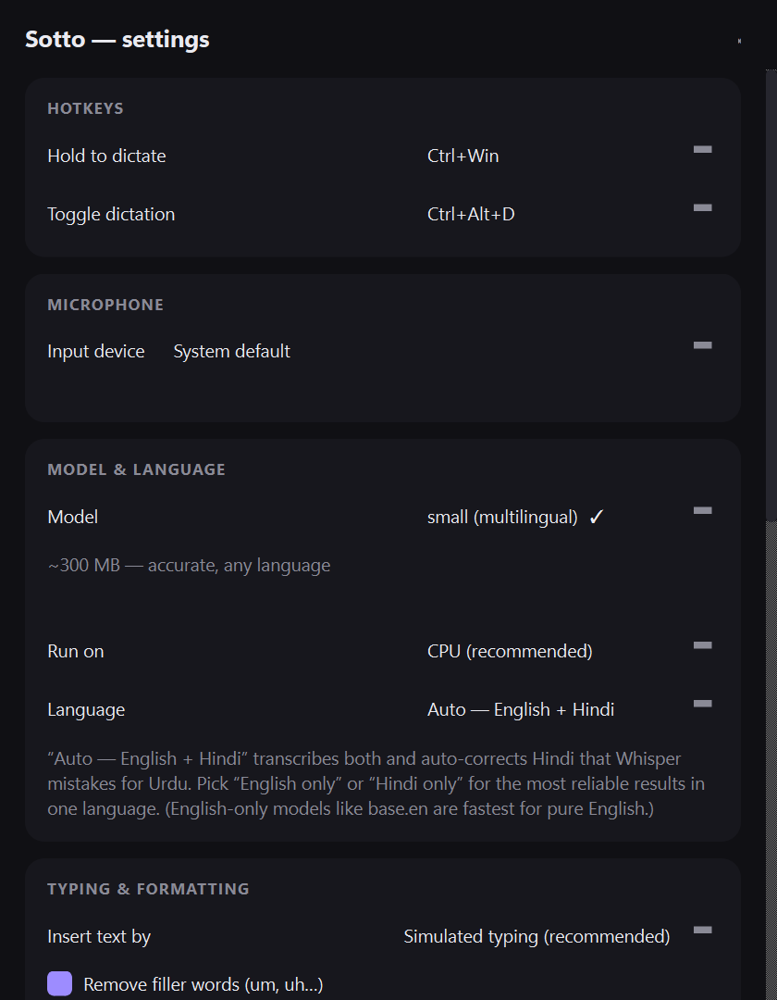

# Sotto — local dictation for Windows

Sotto is a fully local dictation app for Windows (a free, private replacement for cloud
dictation tools like Wispr Flow): **hold a hotkey, speak, release — accurate text appears at
your cursor in any app.** Everything runs on your own machine. **No cloud, no account, no
subscription, no telemetry — every component is free and open source.**

<p align="center">
  <br>
  <em>The floating recording pill — bottom-center, live waveform, never steals focus.</em>
</p>

- **Multilingual by default** — English, Hindi, and Hinglish, auto-detected per phrase, so you
  can leave it recording through a mixed-language meeting. Fully switchable (see below).
- **Live typing** — in toggle mode, text appears as you speak, not only when you stop.
- **Robust** — a voice-activity gate ignores background/static noise (no phantom text), and
  Hindi that Whisper mistakes for Urdu is auto-corrected back to left-to-right Devanagari.
- **Types anywhere** — simulated keystrokes work even where paste is blocked; clipboard-paste
  fallback for long text, with your clipboard saved and restored.
- Speech recognition: OpenAI Whisper models (MIT) running on Intel **OpenVINO** (Apache-2.0),
  int8, on your CPU — chosen after benchmarking faster-whisper, whisper.cpp, and Parakeet
  (OpenVINO was ~2.4× faster on a GPU-less laptop).
- UI: PySide6/Qt (LGPL). Audio: sounddevice/PortAudio (MIT). Everything else: Python stdlib.

## Install (from a release)

1. Download `Sotto-windows-x64.zip` from the [Releases](../../releases) page and unzip it.
2. Run `Sotto\Sotto.exe`. (Windows SmartScreen may warn about an unsigned app — *More info →
   Run anyway*.) Optionally run `install.ps1` to copy it to `%LOCALAPPDATA%\Programs\Sotto`
   and add Start-menu shortcuts.
3. On first launch, open **Settings → Model & language** and click **Download** for the model
   (one-time, ~300 MB, from the official OpenVINO mirror). Then hold **Ctrl + Win** and speak.

> Sotto is CPU-only and downloads its speech model on first run — that one download is the
> only time it ever touches the network.

<p align="center"></p>

## Launch

- **Start menu → "Sotto"** (or run `%LOCALAPPDATA%\Programs\Sotto\Sotto.exe`).
- Sotto lives in the system tray (dark rounded icon with violet waveform bars).
  The tray tooltip shows state: *loading model → Ready*.
- Only one instance runs; launching it again just opens the settings of the running app.

## Dictate

1. **Hold `Ctrl + Win`** (either side) and speak. A dark pill with a live waveform appears at
   the bottom of the screen. It never steals focus from the app you're typing into.
2. Release. The pill shows *transcribing*, then your text is typed at the cursor
   (✓ *inserted*). Typical wait after you stop speaking: **under 1 second**.
3. For long dictation use **toggle mode: `Ctrl + Alt + D`** starts recording,
   press again to stop. In this mode **text is typed as you speak** (live dictation) —
   each phrase appears a second or two after you finish saying it, so you can dictate for
   minutes or take meeting notes hands-free. (Turn this off in Settings → Typing to instead
   insert everything at the end.)

### Languages (Hindi / Hinglish)

Out of the box Sotto uses a **multilingual** model set to **“Auto — English + Hindi.”** It
transcribes English and Hindi (in Devanagari), auto-corrects Hindi that Whisper mis-detects as
Urdu (which would otherwise come out right-to-left), and ignores static/background noise instead
of inventing a random foreign language for it.

Switch languages any time from the **tray icon → Language** submenu (or Settings → *Model &
language*):
- **Auto — English + Hindi** (default) — detects each phrase; best for mixed/Hinglish meetings.
- **English only** / **Hindi only** — force one language for the most reliable single-language
  results (recommended if a whole session is one language).
- **Auto — all languages** — unconstrained 99-language detection (only if you need a third
  language; more prone to mistakes on noise).
- For the fastest *pure-English* dictation, switch **Model** to `base.en` (English-only,
  sub-second).

Tips if accuracy disappoints: pick **English only** or **Hindi only** instead of Auto for a
single-language session; keep the mic close and reduce background noise; and remember this runs
a compact model on your CPU (no GPU on this machine), so it won't match a cloud service word for
word — but it's fully private and free.

Spoken commands: “new line”, “new paragraph”, “comma”, “period” / “full stop”,
“question mark”, “exclamation mark”, “colon”, “semicolon”, “open quote” / “close quote”.
Emails/URLs: “suryansh at gmail dot com” → `suryansh@gmail.com`.
Filler words (um, uh…) are removed automatically (toggle in settings).

## Settings (tray icon → Settings, or left-click the tray icon)

- **Hotkeys** — pick the hold chord (`Ctrl+Win`, `Alt+Win`, `Ctrl+Alt`, `F9`) and the toggle
  combo (`Ctrl+Alt+D`, `Ctrl+Shift+Space`, `Ctrl+Alt+Space`, `F10`, or disabled).
- **Microphone** — input device picker with a live level meter.
- **Model & language** — see below.
- **Typing** — simulated keystrokes (default; works where paste is blocked) or clipboard
  paste (your clipboard is saved and restored). Long texts automatically use paste.
- **Custom dictionary** — names and jargon ("Suryansh" is preloaded). Words are fed to the
  model as context *and* fuzzy-corrected afterwards.
- **History & privacy** — searchable log of past dictations (click to copy). Stored only in
  `%LOCALAPPDATA%\Sotto\history.jsonl`; disable or clear anytime.
- **Session stats** — words dictated and estimated time saved vs. typing.
- **System** — start Sotto automatically with Windows.

## Changing models

Settings → *Model & language*. Downloaded models show a ✓ and switch instantly; others show
a **Download** button (one-time, ~60 MB–1.7 GB from the official OpenVINO mirrors on Hugging
Face — this is the only network access in the app, and only when you click it).

| Model | Size | When to use |
|---|---|---|
| tiny.en | ~60 MB | fastest, English only, noticeably less accurate |
| base.en | ~95 MB | fastest accurate English only — sub-second latency |
| small.en | ~300 MB | most accurate English only; ~2–4 s latency |
| base (multilingual) | ~95 MB | fast, any language / Hinglish, lower accuracy |
| **small (multilingual)** (default) | ~300 MB | English + Hindi + Hinglish, auto-detect; ~2–3 s latency |
| large-v3-turbo (multilingual) | ~1.7 GB | best accuracy, but slow on this machine |

"Run on" lets you switch inference to the Intel iGPU; CPU is recommended (the GPU's first
load compiles for ~90 s, cached afterwards).

Models live in `%LOCALAPPDATA%\Sotto\models`. Config: `%LOCALAPPDATA%\Sotto\config.json`.
Log: `%LOCALAPPDATA%\Sotto\app.log`.

## Dictating into apps that run as Administrator

Windows blocks normal apps from typing into elevated windows (e.g. your VS Code runs
as Administrator). Use the Start-menu shortcut **"Sotto (administrator)"** — one UAC
prompt per launch — and Sotto can type everywhere, elevated or not.

## Rebuild from source

```powershell
cd <this folder>
.\.venv\Scripts\python.exe -m PyInstaller sotto.spec --noconfirm
# result: dist\Sotto\Sotto.exe
```

Tests live in `tests/` (unit, injection round-trip, live-app drive). `PROGRESS.md` documents
the engineering decisions and the on-machine benchmarks behind the engine choice.
